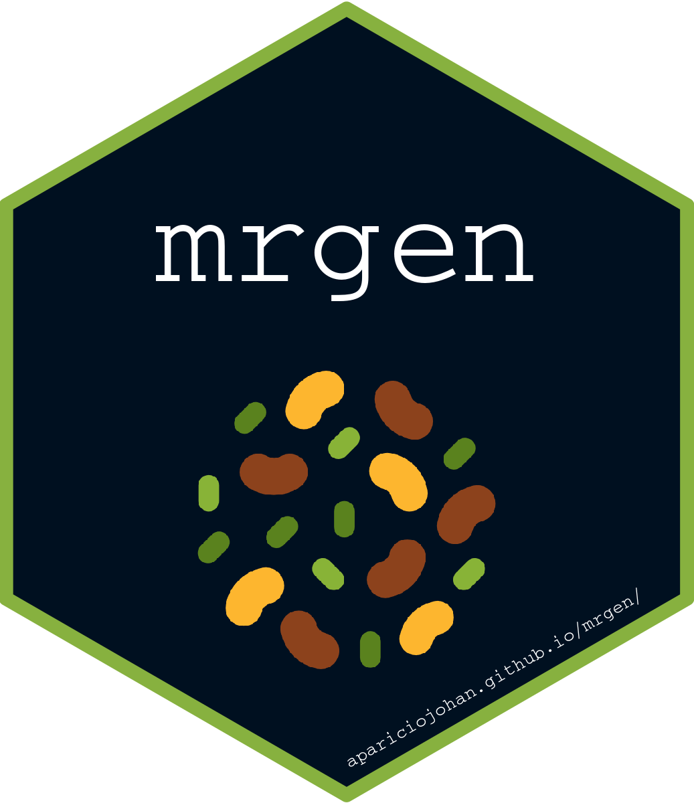

# Genomic Selection 

The GS is a r-package that has been created to run cross validation using BGLR - sommer - ASReml packages. This allows you run CV by command line or with a user interface in shiny.

## Installation

``` r
devtools::install_github("AparicioJohan/GS")
```

``` r
source("https://install-github.me/AparicioJohan/GS")
```

## Run the Shiny app

There's only one exported function in the package and it runs the Shiny app:

``` r
GS::GS_shiny()
```

## Command line

The code below shows how you can run the cross validation.

``` r
# library(sommer)
# data(DT_cpdata)

# geno <- GT_cpdata
# samp <- rownames(GT_cpdata)
# phen <- DT_cpdata

# crossGP(geno, samp, phen, prior = "sommer", niter=2, testporc = 0.3, traits = names(phen)[5])
```
